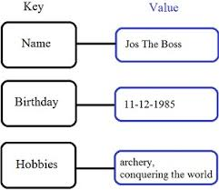
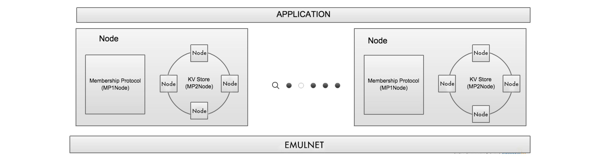

# **Building Fault-Tolerant Key-Value Store**


Building a distributed Fault-Tolerant Key-Value Store on nodes running membership protocol.




---
Table of contents
---

1. [Project Specification](#Project-Specification)
2. [Project Architecture](#Project-Architecture)
3. [Usage](#Usage)
4. [Real-world application](#Real-world-application)
5. [Contribution](#Contribution)
6. [License](#License)

---
Project Specification
---

The project implements the following functionalities:

1. A key-value store supporting CRUD operations (Create, Read, Update, Delete). 
2. Load-balancing (via a consistent hashing ring to hash both servers and keys).
3. Fault-tolerance up to two failures (by replicating each key three times to three successive nodes in the ring, starting from the first node at or to the clockwise of the hashed key).
4. Quorum consistency level for both reads and writes (at least two replicas).
5. Stabilization after failure (recreate three replicas after failure).

---
Project Architecture
---

Similar to [membership protocol](https://github.com/tranlyvu/membership-protocol) project, we are running on three-layer framework that will allow to run multiple copies of peers within one process running a single-threaded simulation engine. The three layers are:
1. The lower EmulNet (network)
2. The middle layer including: MP1Node (membership protocol) and the MP2Node (the key-value store)
3. The application layer.

Think of this like a three-layer protocol stack with App, P2P, and EmulNet as the three layers (from top to bottom). Each node in the P2P layer is logically divided in two components: MP1Node and MP2Node. MP1Node runs a membership protocol and MP2Node is implemented to support all the KV Store functionalities. At each node,the key-value store talks to the membership protocol and receives from it the membership list. It then uses this to maintain its view of the virtual ring. Periodically, each node engages in the membership protocol to try to bring its membership list up to date.



Please note that the membership list may be stale at nodes! This models the reality in distributed systems.  Also, when reacting to a failure (e.g., by re-replicating a key whose replica failed),there is no contention among the would-be replicas, i.e. no over-replicate keys.

Each MP2Node implements both the client-side as well as the server-side APIs for all the CRUD operations. The application layer chooses a non-faulty node randomly as the client. The same node can be considered as the coordinator. The coordinator is assumed to be never crashed. The Key-Value store accepts std::string as key and value.

---
### Logging

The following functions in Log.h to log either successful or failed CRUD operations (this is how the grader will check for correctness of implementation):
1. Log::logCreateSuccess, Log::logReadSuccess, Log::logUpdateSuccess, Log::logDeleteSuccess: Use these functions to log successful CRUD operations. 
2. Log::logCreateFail, Log::logReadFail, Log::logUpdateFail, Log::logDeleteFail: Use these functions to log failed CRUD operations.

What nodes should log the messages? 
1. All replicas (non-faulty only) should log a success or a fail message for all the CRUD operations AND
2. If the coordinator gets quorum number of successful replies then it should log a successful message, else it should log a failure message

---
Usage
---

Downloading a [release](https://github.com/tranlyvu/Fault-Tolerant-Key-Value-Store/releases)

Test cases have are provided in testcases directory. The conf files contain information about the parameters used by your application:

```
MAX_NNB: 10
CRUD_TEST: CREATE
```
where MAX_NNB represents the max number of neighbors, CRUD_TEST is the operation.

For example:

```
$ make clean
$ make
$ ./Application ./testcases/create.conf
or 
$ ./Application ./testcases/delete.conf
or
$ ./Application ./testcases/read.conf
or
$ ./Application ./testcases/update.conf
```

There is a grader script Grader.sh that execute all configurations in testcases folder.The tests include:
1. Basic CRUD tests that test if three replicas respond 
2. Single failure followed immediately by operations which should succeed (as quorum can still be reached with 1 failure) 
3. Multiple failures followed immediately by operations which should fail as quorum cannot be reached
4. Failures followed by a time for the system to re-stabilize, followed by operations that should succeed because the key has been re-replicated again at three nodes. For more information about the test, see the comments in Application.cpp starting at Line 232.

---
Real-world application
---

This is an experimental implementation project and under heavy development, I do not yet recommend using in production environments.

However, here are some ideas to integrate this into real-world application: The MP has been designed for use of porting to a real distributed system. Start by changing the EmulNet layer and then perhaps using multithreading.
