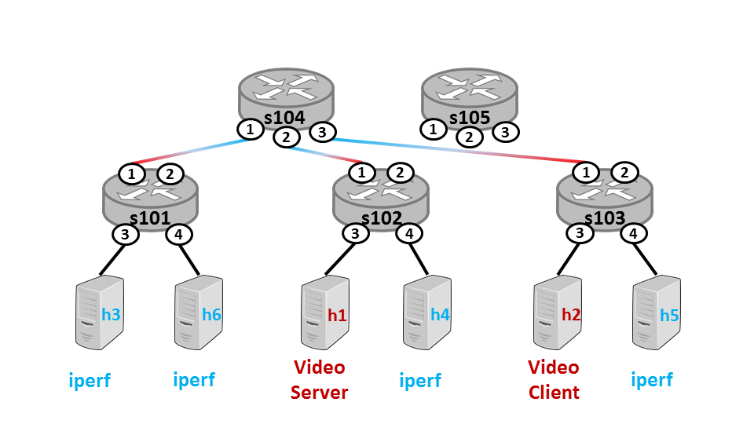
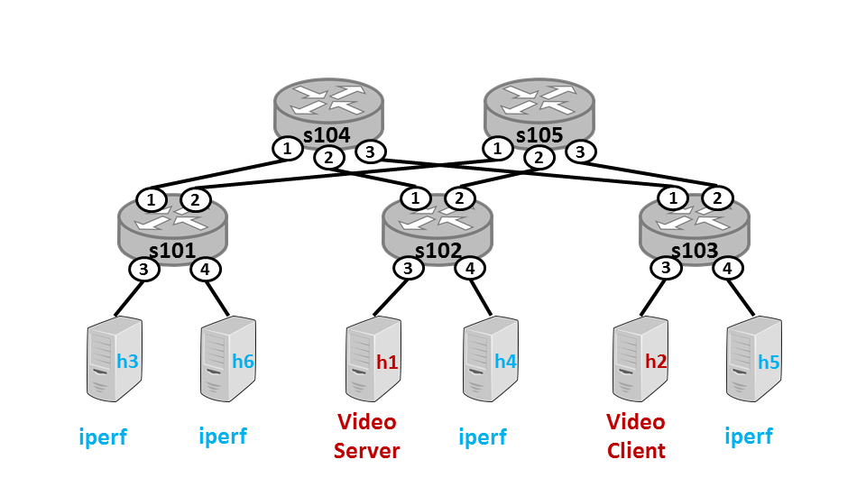
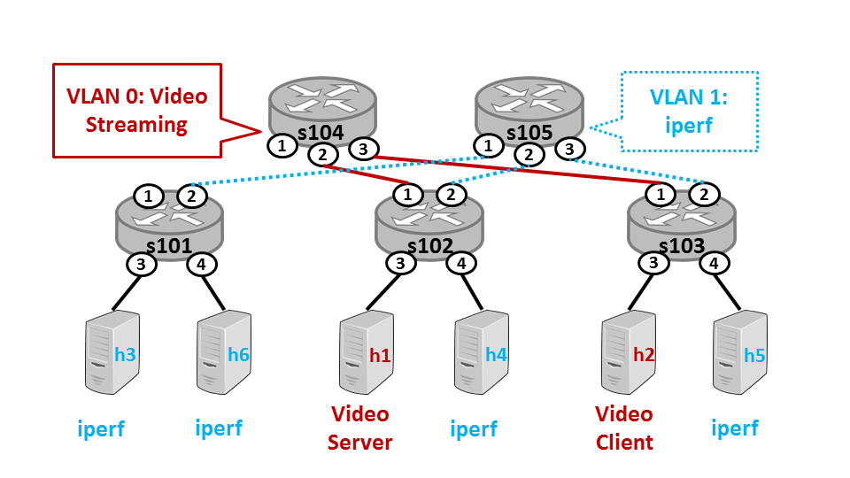

# **Emulated Software-Defined Network Application**

Monitored and improve routing policy on an emulated network and application using Software-Defined Network (SDN).

---
Table of Contents
---

1. [Setup instructions](#Setup-instructions)
2. [Video Streaming](#Video-Streaming)
3. [Traffic Monitor](#Traffic-Monitor)
4. [Tenants](#Tenants)
5. [Contribution](#Contribution)
6. [License](#License)

---
Setup instructions
---

Software Requirements

1. Download and install the following programs:

* [VirtualBox](https://www.virtualbox.org/wiki/Downloads)
* [7-Zip](http://www.7-zip.org/download.html)

2. Download the VM disk (~600 MB):

* [moocvm.7z](https://d3c33hcgiwev3.cloudfront.net/_7ff019cc50f9be488179d2dfb78bda8e_moocvm.7z?Expires=1545696000&Signature=DOsyD92CBLQwh40jxBU58gJpa2tdGfBFBNsIFXyT7UJZxwQIoRUETRzT4q-PgLxABgyLUBWnV81TBC8cfTBUvY72F0AhyBBjxl7SRUIoTGVplvieIQmSYWDrmlvXqhmVFBEVD9n8btSq8Fk1kVIYomRbFoBjfWJoS69sqkDqSkY_&Key-Pair-Id=APKAJLTNE6QMUY6HBC5A)

3. Extract moocvm.7z to obtain the file MoocVm-disk1.vmdk. (Note: the vmdk is approximately 2.8 GB.)

VM Setup

The details may vary minutely on different operating systems and corresponding versions of VirtualBox.

1. Open VirtualBox Manager
2. From the menu bar, select Machine --> New
3. Create a VM with the name cloudnetmooc, type Linux and version Ubuntu (64bit), and click Next
4. Set the memory size to at least 2048MB and click Next
5. Select the bullet Use an existing virtual hard drive file
6. Click the folder icon next to the drop down menu and navigate to the folder containing MoocVm-disk1.vmdk
7. Select MoocVm-disk1.vmdk and press Open
8. Click Next

Recommended: Configure the VM with additional processors and video memory.

1. In the VirtualBox Manager, select the newly created VM cloudnetmooc
2. Click the Settings icon below the menu bar
3. In the Settings menu, select System from the left side menu
4. Click on the Processor tab and increase the count to at least 2
5. Select Display from the left side menu
6. Increase the Video Memory to at least 32MB

Start the VM.

1. In the VirtualBox Manager, select the newly created VM cloudnetmooc
2. Click the Start icon below the menu bar
3. When the VM starts, log in with the username mooc and password mooc (Note: the sudo password is also mooc)
4. To start the desktop environment, type startx and press Enter

To change the VM guest display size, you can configure the display to auto-adjust to the VM window size. From the VM window, select View --> Auto-resize Guest Display. Alternatively, you can set the resolution manually inside the VM by performing the follow steps.

1. Click Applications Menu --> Settings --> Display
2. Select the desired resolution from the Resolution drop down menu
3. A confirmation window may appear, click Keep this Configuration
4. Close the Display window

Note: To keep the distributed image small, we have included only the lightweight graphical editor mousepad. You can install your preferred editor using the command sudo apt-get install [emacs, vim, nano]. Remember, the sudo password is also mooc.

Common Problems

When creating a new VM, there is no option for 64-bit Ubuntu in VirtualBox.

* This may be caused by several issues: virtualization extensions are not enabled or Hyper-V may conflict with VirtualBox.
* Enable Virtualization Extensions: Ensure you have enabled virtualization extensions (VT-x/AMD-V) in your system's BIOS. The exact instructions will depend on your motherboard, but generally the instructions follow:

1. Reboot your machine and open the BIOS menu. Depending on your system, this typically is done by pressing the delete key, the F1 key, the F4 key, or the Alt key
2. Open the Processor menu
3. Enable Intel Virtualization Technology (Intel VT-X). AMD-V extensions will already be enabled. The extensions may be also labeled "Virtualization Extensions" or "Vanderpool" or various other names
4. Select Save & Exit
5. Reboot the machine

* Disable Hyper-V: On Windows machines, Hyper-V can conflict with VirtualBox. Disable Hyper-V under Settings --> Control Panel --> Turn Windows Features On or Off.

I've enabled virtualization extensions but the VM does not start
* Ensure virtualization extensions are enabled in VirtualBox for your new VM. In VirtualBox, select the VM and click Settings. On the left side menu, click System, then select the Acceleration tab. Make sure the box labeled Enable VT-x/AMD-V is checked.

My hardware doesn't support virtualization extensions
* You can download a 32-bit version of the VM image here.

There is no 7-zip client for my OS
* OS X users can download one of several 7-zip clients:

-[Rar extractor](https://itunes.apple.com/us/app/rar-extractor-free/id646295438?mt=12)

-[Keka](http://www.kekaosx.com/)

-[7zX](http://7zx.updatestar.com/)

* Ubuntu users can install 7zip using sudo apt-get install p7zip-full and extract the image using 7za x moocvm.7z.

After downloading VM disk, how I can I be sure it was not corrupted during transfer?
* You can verify the integrity using md5sum. The checksum for the disks are:
* moocvm.7z: 74edc5f994154256fdc5322b9ed4053a
* moocvm32.7z: 6ddf313d51f212d598f14a2a37c918cd

---
Video Streaming
---

In this part, we will run an emulated network and observe the impact of routing policies on application performance. 

Our system uses the network emulator [mininet](http://mininet.org/) to run a [software-defined network (SDN)](https://en.wikipedia.org/wiki/Software-defined_networking). To control the SDN, we'll use the controller Ryu. 

The datacenter will use a topology consisting of core switches, edge switches, and hosts, as shown below. Switches s104 and s105 are core switches, which connect to edge switches s101, s102, and s103. Each edge switch connects to all core switches, as well as two hosts (e.g., two of h1–h6). The datacenter will have two tenants – one running iperf to simulate bulk transfers and another streaming video. The video server will adapt the video quality to the available bandwidth between the video server and client.

Each switch connects to another switch or host through a physical or virtual port. The physical ports are shown in the topology diagram as circled numbers. Each switch also has virtual ports to send packets to the SDN controller or flood traffic (i.e., send a packet out all physical ports except the one on which it was received.)

Next, you will start the emulated environment and see the impact of a poor routing policy on application performance across different tenants. Specifically, you will see how traffic from the iperf tenants interferes with the available bandwidth to the video streaming tenant. This lack of performance isolation between tenants in a datacenter is not ideal. In later parts, we will write policies that achieve better isolation.

The naive policy you will see in action will route all traffic from the edge switches to a single core switch, as show by the mixed red and blue lines. Notice that s104 can become a bottleneck in the network, and s105 is completely unused. As a result, the traffic of one tenant can easily impact another tenant's perceived network performance.

To start the emulator:

1. In terminal 1, cd to ~/cloudnetmooc and run sudo ./mdc --vid

2. In terminal 2, cd to ~/cloudnetmooc/minidc/controller

* Start Ryu: ryu-manager controller.py
* The default (naive) routing policy will be loaded automatically.

3. Now that Ryu has started, press <enter> in terminal 1.

* A Chrome window will pop up. Press play to start the video.
* Observe the video quality is poor and plays only in low quality. The video may even pause to buffer.

4. End the experiment:

* In terminal 1, type exit<enter> (do not Ctrl-c to exit; this will interrupt the teardown process). If you accidentally Ctrl-c and interrupt the process, run sudo mn -c.
* In terminal 2, Ctrl-c to stop Ryu.

--- 
Traffic Monitor
---

Now that we have seen the impact of poor routing policies on application performance, our next step as network operator will be to quantify the problem by implementing a bandwidth monitor. To do this, we will extend our Ryu controller application to collect bandwidth information from the switches. Ryu and SDN switches support port statistics requests. This allows the controller application to query switches about the number of bytes, packets, and errors for each port (physical or virtual) on the switch.

We will be using the same topology and tenant placement as the previous part, shown below.

In this part, you will add code to the file ~/cloudnetmooc/minidc/controller/bwmon.py. This file contains the code to issue a port statistics request to each switch in the network. Each switch responds asynchronously with a packet containing the statistics for each of its ports. Remember, each port is connected to a device on the network, such as a host or another network.

All the code for issuing port statistics requests is provided for you. You will add a small amount of code to handle the reply. In particular, you will extend the function statsReplyHandler() in the file bwmon.py. This function is invoked each time the controller receives a port statistics reply from a switch. The reply contains a list of statistics for each port. Your code should determine which host is associated with port in the reply and update the bandwidth usage for that host. Useful API functions are detailed in the source file and comments. Your solution should not require any code outside the function statsReplyHandler(). Hint: you only want to examine entries in the statistics list for physical ports, not virtual ports. You can filter out virtual ports by checking if the port has an entry in the list self.topo.ports[switchName].keys() for a switch switchName.

If coded correctly, you should see bandwidth statistics reported to the dashboard at http://127.0.0.1. (Note: this page is only accessible when the script mdc is running.) You will also see bandwidth usage statistics (grouped by tenant) printed to the terminal executing Ryu.

### Instructions

To validate your code, open two terminals in the VM and perform the following steps:

1. In terminal 1, cd to ~/cloudnetmooc and run: sudo ./mdc --vid

2. In terminal 2, cd to ~/cloudnetmooc/minidc/controller

Start Ryu: ryu-manager controller.py.
The default (naive) routing policy will be loaded automatically.
3. Now that Ryu has started, press <enter> in terminal 1.

A Chrome window will pop up, press play to start the video.
Observe the video quality is poor and plays only in low quality. The video may even pause to buffer.
4. Open a new, different instance of Chrome from the menu bar or Desktop.

Load the dashboard by navigating to http://127.0.0.1.
Observe that the graphs now report data, including bandwidth usage for each host and tenant. Note: opening a new window from the video player using Ctrl-N will open a sandboxed instance that does not have access to the dashboard.
5. End the experiment:

In terminal 1, type exit<enter> (do not Ctrl-c to exit, this will interrupt the teardown process. If you accidentally Ctrl-c and interrupt the process, run sudo mn -c).
In terminal 2, Ctrl-c to stop Ryu.

Expected Result: If your code is working properly, you should see bandwidth data for each host and tenant in the dashboard at http://127.0.0.1.

---
Current routing
---

In the previous part we learned how much each host contributes to the amount of congestion in the network. Now, you will improve the routing policy to provide better isolation between the tenants.

In parts 1 and 2, the routing policy sent all traffic from edge switches through one core switch. You will improve the policy by distributing the traffic from edge switches across all core switches. Each core switch will have a set of one or more tenants assigned to it. Edge switches will then route traffic to the appropriate core switch based on the tenant association of the source and destination.

We will be using the same topology as the previous parts. Notice in the topology diagram below that each core switch handles traffic for one tenant.

In this part, you will add code to the file ~/cloudnetmooc/minidc/controller/policy.py. Specifically, you will extend the function build() in the class StaticRouting. Your code should install a rule in each edge switch. If the destination host is a neighbor – that is, if the host is directly connected to the switch via a port – output the packet out that port. If not, send the packet "up" to the core switch that is associated with the destination host's VLAN. You may use the "upward" rules in DefaultPolicy.build() as a rough guide. Useful API functions are also detailed in the source file and comments.

### Instructions

To validate your code, open two terminals in the VM and perform the following steps:

1. In terminal 1, cd to ~/cloudnetmooc and run: sudo ./mdc --vid

2. In terminal 2, cd to ~/cloudnetmooc/minidc/controller.

Start Ryu: ryu-manager controller.py.
The default (naive) routing policy will be loaded automatically.
3. Now that Ryu has started, press <enter> in terminal 1.

A Chrome window will pop up, press play to start the video.
Observe the video quality is poor and plays only in low quality. The video may even pause to buffer
4. Open a new, different instance of Chrome from the menu bar or Desktop.

Load the improved routing policy by selecting the radio button labeled "Static" and pressing the "Update Policy" button. Observe the video plays almost entirely in high quality.
5. End the experiment:

In terminal 1, type exit<enter> (do not Ctrl-c to exit, this will interrupt the teardown process. If you accidentally Ctrl-c and interrupt the process, run sudo mn -c).
In terminal 2, Ctrl-c to stop Ryu.

If coded correctly, you should see an improvement in the video quality compared to part 1. The video may not play entirely in high quality, but you should notice an improvement from the policy in part 1.

---
Tenants
---

While the routing policy in the previous part utilizes all core switches, statically assigning core switches to route traffic for each VLAN can be problematic. Not all tenants use the same amount of bandwidth, so the load on the core switches may not be evenly distributed. As a result, one core switch may handle traffic for many tenants using large amounts of bandwidth while the other core switches are under utilized. In this part, we will observe this scenario and update our routing policy to account for different traffic demands between tenants.

We will use a larger topology for this part, shown below, with 3 core switches, 4 edge switches, and 5 hosts per edge switch. There will be 3 different types of tenants, each with 4 hosts: Iperf, Inactive, and Memcached. The 2 Iperf tenants consist of hosts running iperf to simulate bulk transfers. Hosts that are members of the 2 Inactive tenants will not transfer any data. The Memcached tenant will consist of one client retrieving memcached objects, in parallel, from 3 different memcached servers. This will simulate a client loading a web page of multiple objects.

Rather than pre-assigning VLANs to particular core switches, your new routing policy will create a flow scheduling policy that balances flows across core switches, regardless of their VLAN/tenant association. You will implement this improved policy in the file ~/cloudmooc/minidc/controller/policy.py. Specifically, you will add code to the function minUtilization() in the class AdaptivePolicy. Your code should use the dictionary self.utilization to find the least utilized core switch. This dictionary stores switch names as keys and utilization (in bytes) as the value. Remember: since we are balancing the utilization among core switches, the dictionary self.utilization will only contain keys for core switches. Your code should not need to reference any other modules or objects aside from self.utilization.

### Instructions
We will explore this scenario using memcached, a caching system commonly used for caching objects in a web page. A client will issue requests to memcached servers and record the response time to load all the objects. The client will perform 20 page loads and record the median and 95th percentile from these 20 trials. The results will be reported at the bottom of the dashboard at http://127.0.0.1.

To validate your code, perform the following steps:

1. In terminal 1, cd to ~/cloudnetmooc and run: sudo ./mdc --adp. Note: use the parameter --adp for this part, not --vid.

2. In terminal 2, cd to ~/cloudnetmooc/minidc/controller.

Start Ryu: ryu-manager controller.py.
The default (naive) routing policy will be loaded automatically.
3. Now that Ryu has started, press <enter> in terminal 1

4. Open a Chrome instance from the menu bar and navigate to http://127.0.0.1.

Wait several seconds and observe the graph of memcached response times updates.
Load the routing policy from part 2 by selecting the radio button labeled Static and pressing the Update Policy button.
Observe that the response time does not significantly decrease.
Load the newest routing policy by selecting the radio button labeled Adaptive and pressing the Update Policy button.
If coded correctly, your newest routing policy should significantly decrease the response time.

5. End the experiment:

In terminal 1, type exit<enter> (do not Ctrl-c to exit, this will interrupt the teardown process. If you accidentally Ctrl-c and interrupt the process, run sudo mn -c).
In terminal 2, Ctrl-c to stop Ryu.

Expected Result: If your code is working properly, you should see the memcached response time improve when the adaptive policy is loaded. In particular, you should see a noticeable improvement in the 95th percentile compared to the default and static policies